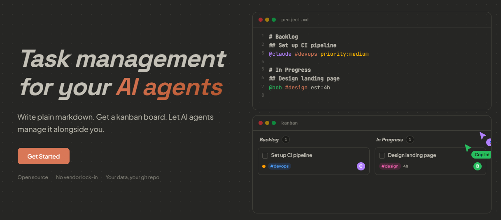
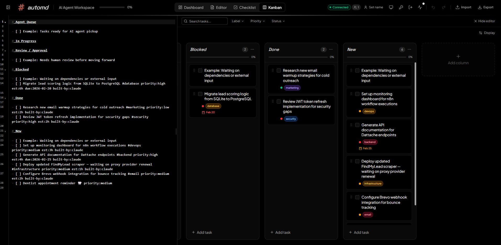

<p align="center">
  
</p>

<p align="center">
  <strong>AI-native task management powered by plain markdown.</strong><br>
  Write <code>.md</code> files. Get kanban boards. Let AI agents manage tasks alongside you.
</p>

<p align="center">
  
  
</p>

---

<p align="center">
  
</p>

## Features

- **Four views** — dashboard, rich markdown editor, checklist, and drag-and-drop kanban
- **Plain markdown storage** — tasks are `.md` files, no proprietary database
- **MCP server** — Claude Desktop and Claude Code can manage your boards directly
- **Real-time sync** — WebSocket-based live updates across all connected clients
- **Inline metadata** — assignees, labels, priority, due dates, estimates as plain text tokens
- **Split editor** — toggle the markdown editor alongside checklist or kanban views (`Ctrl+E`)
- **Keyboard-first** — command palette (`Ctrl+K`), shortcuts, and fast navigation
- **Dark mode** — system-aware theme toggle
- **Self-hosted** — run via Docker or from source, your data stays on your machine

## Quick Start

### Docker (Recommended)

```bash
docker compose up -d
open http://localhost:4800
```

The default `docker-compose.yml` pulls from `ghcr.io/luka-zivkovic/automd:latest`. Data is persisted in a Docker volume.

<details>
<summary>Build from source instead</summary>

Edit `docker-compose.yml` and swap the image for a local build:

```yaml
services:
  automd:
    # image: ghcr.io/luka-zivkovic/automd:latest
    build: .
```

Then run `docker compose up -d --build`.
</details>

### From Source

```bash
git clone https://github.com/luka-zivkovic/automd.git
cd automd
pnpm install
pnpm dev
```

The web app runs on [localhost:5173](http://localhost:5173) and the API server on [localhost:4800](http://localhost:4800).

## Updating

### Docker

```bash
docker compose pull
docker compose up -d
```

### From Source

```bash
git pull
pnpm install
pnpm build:production
```

The app checks for new releases in the background and shows a banner when an update is available. Disable with `AUTOMD_DISABLE_UPDATE_CHECK=true`.

## Configuration

Copy `.env.example` to `.env` for local overrides:

| Variable | Default | Description |
|----------|---------|-------------|
| `AUTOMD_PORT` | `4800` | API server port |
| `VITE_AUTOMD_SERVER` | `http://localhost:4800` | Server URL used by the frontend |
| `AUTOMD_STORAGE_DIR` | `~/.automd` | Data storage directory |
| `AUTOMD_DISABLE_AUTH` | `false` | Disable authentication (dev only) |
| `AUTOMD_DISABLE_UPDATE_CHECK` | `false` | Disable GitHub release update checks |
| `AUTOMD_UPDATE_CHECK_INTERVAL` | `21600000` | Update check interval in ms (default 6h) |
| `AUTOMD_S3_ENDPOINT` | — | S3-compatible endpoint for backup sync |
| `AUTOMD_S3_BUCKET` | — | S3 bucket name |
| `AUTOMD_S3_ACCESS_KEY_ID` | — | S3 access key |
| `AUTOMD_S3_SECRET_ACCESS_KEY` | — | S3 secret key |
| `AUTOMD_S3_PREFIX` | — | Optional namespace prefix for multi-tenant |

## Authentication

On first launch, AutoMD prompts you to create an admin account (email + password). Once set up:

- The web UI requires login — sessions are managed via JWT tokens
- API requests (including MCP) authenticate via API keys
- Set `AUTOMD_DISABLE_AUTH=true` to skip authentication entirely (dev only)

### API Keys

Generate API keys from **Settings > API Keys** in the web UI. Use them for MCP integration and any external API access:

```
Authorization: Bearer <your-api-key>
```

## MCP Integration

AutoMD ships with an MCP server that lets AI agents manage boards, tasks, and columns.

### Claude Desktop

Add to your Claude Desktop config (`~/Library/Application Support/Claude/claude_desktop_config.json` on macOS, `%APPDATA%\Claude\claude_desktop_config.json` on Windows):

```json
{
  "mcpServers": {
    "automd": {
      "command": "npx",
      "args": ["tsx", "/absolute/path/to/automd/packages/mcp/src/index.ts"],
      "env": {
        "AUTOMD_SERVER_URL": "http://localhost:4800",
        "AUTOMD_API_KEY": "your-api-key-here"
      }
    }
  }
}
```

### Claude Code (CLI)

Add to your project's `.mcp.json` or `~/.claude.json`:

```json
{
  "mcpServers": {
    "automd": {
      "command": "npx",
      "args": ["tsx", "/absolute/path/to/automd/packages/mcp/src/index.ts"],
      "env": {
        "AUTOMD_SERVER_URL": "http://localhost:4800",
        "AUTOMD_API_KEY": "your-api-key-here"
      }
    }
  }
}
```

> **Note:** The MCP server runs as a separate stdio process on the host. It connects to the AutoMD server's HTTP API, so make sure the server is running (`pnpm dev:server` or via Docker).

## Architecture

```
┌──────────────────────────────────────────────────────┐
│              React Frontend (Vite)                    │
│   Editor View  ·  Checklist View  ·  Kanban View     │
│                                                      │
│   Zustand Stores ──► @automd/shared (parser/mutators)│
└──────────┬──────────────────────┬────────────────────┘
           │ HTTP / WebSocket     │ localStorage
           │                      │ (offline mode)
┌──────────▼──────────┐    ┌──────▼───────────────────┐
│  @automd/server     │    │  Browser localStorage    │
│  Express + WS :4800 │    └──────────────────────────┘
│  Storage: ~/.automd/ │
└──────────┬──────────┘
           │ HTTP API
┌──────────▼──────────┐
│    @automd/mcp      │
│  MCP Server (stdio) │◄── Claude Desktop / Claude Code
└─────────────────────┘
```

**Data flow:** Markdown files → parsed to AST (remark) → tasks/columns extracted → UI mutations produce new AST → serialized back to markdown → synced via WebSocket.

## Task Metadata Format

Tasks support inline metadata tokens:

```markdown
- [ ] Implement login @alice @bob #backend #auth priority:high due:2025-04-01 est:8h
```

| Token | Example | Description |
|-------|---------|-------------|
| `@username` | `@alice` | Assignee |
| `#label` | `#backend` | Label/tag |
| `priority:level` | `priority:high` | Priority (high, medium, low) |
| `due:date` | `due:2025-04-01` | Due date (ISO format) |
| `est:hours` | `est:8h` | Time estimate |
| `created-by:user` | `created-by:sarah` | Creator |
| `built-by:user` | `built-by:alex` | Builder |
| `archived:true` | `archived:true` | Archive flag |

## Project Structure

```
automd/
├── src/                          # React frontend
│   ├── components/               # UI components (editor, checklist, kanban, etc.)
│   ├── store/                    # Zustand stores (document, files, UI state)
│   ├── hooks/                    # React hooks (sync, keyboard shortcuts, search)
│   └── lib/                      # Utilities, templates, markdown helpers
├── packages/
│   ├── shared/                   # @automd/shared — markdown parsing & mutation
│   ├── server/                   # @automd/server — REST API + WebSocket
│   └── mcp/                      # @automd/mcp — MCP server for LLM agents
├── docker-compose.yml            # Docker deployment
├── Dockerfile                    # Multi-stage production build
└── pnpm-workspace.yaml           # Workspace packages
```

## Scripts

| Command | Description |
|---------|-------------|
| `pnpm dev` | Start server + web app concurrently |
| `pnpm dev:web` | Start Vite dev server only |
| `pnpm dev:server` | Start API server only (with watch) |
| `pnpm dev:mcp` | Start MCP server only (with watch) |
| `pnpm build:production` | Build all packages for production |
| `pnpm test` | Run all tests |
| `pnpm lint` | Run ESLint |

## Storage

Data is stored at `~/.automd/` (or `AUTOMD_STORAGE_DIR`):

```
~/.automd/
├── manifest.json     # Board and project metadata index
└── boards/
    ├── my-board.md   # Board content as markdown
    └── ...
```

In Docker, the storage directory is `/data`, mapped to a named volume for persistence.

## Testing

```bash
pnpm test                              # Run all tests
pnpm --filter @automd/shared test      # Shared library tests
pnpm --filter @automd/server test      # Server API tests
pnpm test -- --watch                   # Watch mode
```

## Contributing

We welcome contributions! See [CONTRIBUTING.md](CONTRIBUTING.md) for development setup and guidelines.

## License

AutoMD is released under the [Sustainable Use License](LICENSE.md).

- **Free** for personal use, internal business operations, development, and testing
- **Cannot** be offered as a hosted/managed service to third parties
- Files containing `.ee.` in their filename are subject to the AutoMD Enterprise License — contact hello@automd.io for enterprise licensing

## Roadmap

- [ ] Recurring / repeating tasks
- [ ] Board templates
- [ ] GitHub / GitLab issue sync
- [ ] Team collaboration features (enterprise)
- [ ] Mobile-responsive views
- [ ] Calendar view
